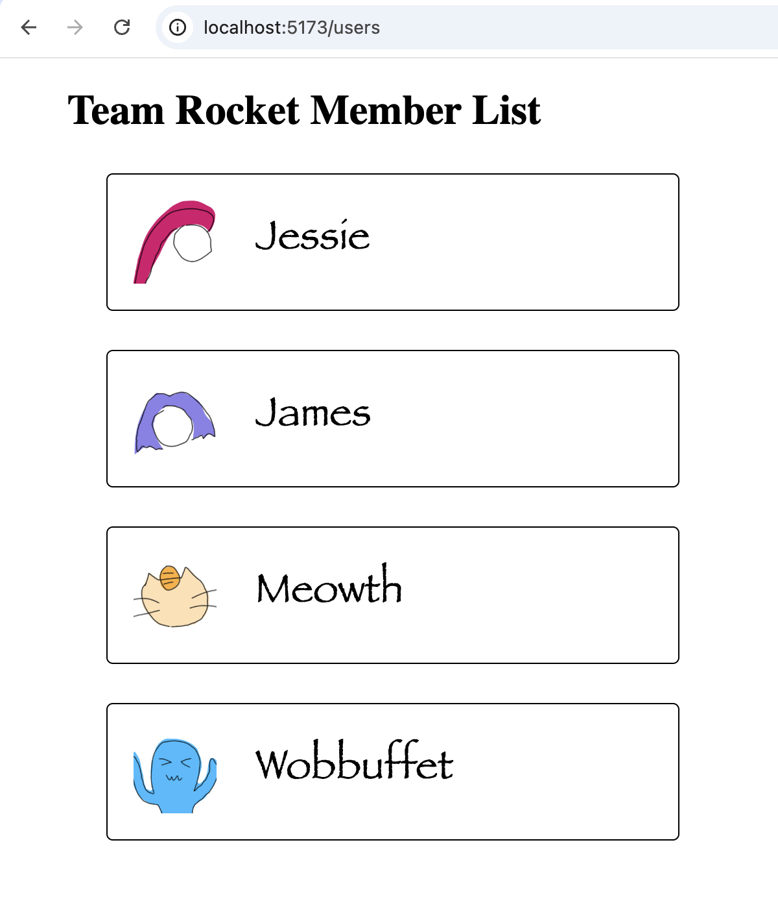

# COMPSCI 719 Test 3 Revision - Team Rocket Member List

In this practical test, you will complete the Node.js / Express code for route handlers that will send data relating to team rocket members. You will then use those route handlers to complete the Svelte code for pages that allow a user to view this data.

**Important:** Before starting the test, read these instructions _carefully_. Have a look through the test files and make sure you understand what is already there.

## General instructions

This project contains **two folders**:
- `backend`, which contains the Node.js / Express app
- `frontend`, which contains the Svelte app

You will need to run `npm install` and `npm run dev` in *both* folders to run all of the code in this test. In order for the Svelte app to work properly, both the backend and frontend need to be running at the same time. You will need to open two separate terminals to do this.

You have a **two hour** time limit for this test. At the end of the test, make sure to `push` your changes to your `main` branch on GitHub. That will serve as your submission. This test is marked out of **60 marks**, and is worth **10%** of your final grade for COMPSCI 719.

**NOTE:** You are allowed to use the Visual Studio Code extensions for Svelte and Postman. You should install these before starting the test.

### Allowed material

This is an **open book** test. You may use any paper-based notes (printed or handwritten). You may also use any online material, provided it does not violate one of the restrictions listed below.

### Restrictions

During the test, you must adhere to _all_ of these restrictions _at all times_:

1. You must use one of the lab machines.

2. You must not use Generative AI of any kind.

3. You must not solicit help from other people, directly or indirectly, in person or via any electronic means.

4. You must not use translation tools.

**If you are caught violating any of these restrictions _for any reason_ (even accidental), you will immediately receive 0 marks for the test. There are no excuses.**

### Submission instructions

The last commit to your `main` branch at the test deadline will serve as your submission. The invigilators will allow you a brief period of time after the test (no more than 10 minutes) in order to make your final commit, before you leave the room. Commits made after this time will be ignored, as will commits to any branch other than `main`.

You may need to use the following git commands:

- `git config --global user.name "Your Name"`
- `git config --global user.email "Your Email Address"`
- `git add .`
- `git commit -m "Commit Message"`
- `git push`

## Task 1 - Retrieve users

Add a new route handler that handles **GET** requests made to `/users`.

This route handler should return a 200 status code and include a list of all users from the [`teamRocket`](backend/src/data/teamRocket.js) array in the response body.

**Note:** only the `id` and `name` of each user should be included.

For example, if the client sends a request to [localhost:3000/users](http://localhost:3000/users), then the response should look similar to this:

```json
[
    {
        "id": 1,
        "name": "Jessie"
    },
    {
        "id": 2,
        "name": "James"
    },
    {
        "id": 3,
        "name": "Meowth"
    },
    {
        "id": 4,
        "name": "Wobbuffet"
    }
]
```

## Other backend tasks

**GET** `/users/:id` - retrieve user by id

**GET** `/users?name=` - retrieve user by name

**GET** `/users/:id/friends` - retrieve friend list of user

**POST** `/users/:id/friends` - add friend

**DELETE** `/users/:id/friends` - remove friend

**PATCH** `/users/:id` - edit name/avatar/bio

**POST** `/users` - create new user

**DELETE** `/users` - delete user


## Task 2 - Display all users

Create a new page for [localhost:5173/users](http://localhost:5173/users) that displays a list of all users.

To get the list of users, your Svelte app will need to make a **GET** request to your Node.js / Express app using the `fetch()` function.

Once you have fetched the list of users, you should display the name and avatar of each user on the page.

**NOTE:** since you need a combination of data from different API endpoints, you will need to make more than one request in order to obtain everything you need.

You can find the avatar files in the [`avatars`](frontend/static/avatars) folder. If none of the files there match a particular user's `avatar`, you should display a gray square instead.

Make sure that the width and height of your avatar images are the same, including the gray square that is displayed for users without a valid avatar.

Your page should look similar to the image below:




## Other frontend tasks

`/users` - include hyperlink to go to `/users/:id`

`/users/:id` - display information about a specific user

`/search` - search for users by name
